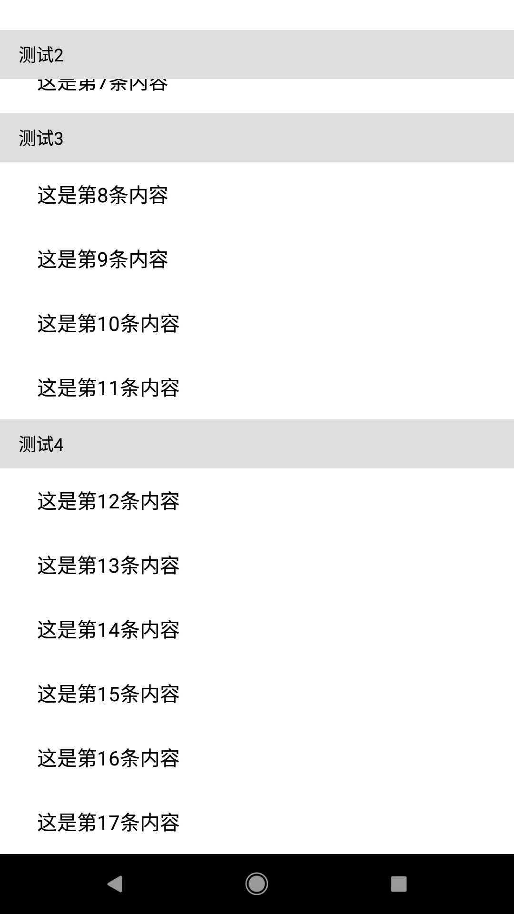

### RecyclerView实用功能(一)粘性头部

#### 前言 
Android的日常开发中，RecyclerView绝对是个高频使用的控件,我们也经常碰到各种常见的需求，
比如粘性头部，多级列表等等，这会开一个系列，记录这些有关RecyclerView功能的实现方式。
内容会同步至我的[CSDN博客](https://blog.csdn.net/u012987393)

#### 效果


#### 实现思路
思路很巧妙，也很简单，在RecyclerView外部容器添加一个HeaderView，然后RecyclerView每一个Item
添加相同的HeaderView。第一个Item显示HeaderView，后面的Item根据需求决定Item显示与否。
最关键的操作步骤是，控制外部HeaderView如何显示，当Iiem移动到外部HeaderView下面时，
相应要控制外部HeaderView一起移动，给RecyclerView添加滑动监听即可：
```
private class ScrollListener extends RecyclerView.OnScrollListener {
        @Override
        public void onScrolled(RecyclerView recyclerView, int dx, int dy) {
            super.onScrolled(recyclerView, dx, dy);
            View view = recyclerView.getChildAt(0);
            if(view != null && view.getContentDescription() != null) {
                stickyHeader.setVisibility(View.VISIBLE);
                tvHeader.setText(String.valueOf(view.getContentDescription()));
            }
            View underView =
                    recyclerView.findChildViewUnder(stickyHeader.getMeasuredWidth() / 2
                            , stickyHeader.getMeasuredHeight() + 1);//获取位于头部下方的itemView
            if(underView != null && underView.getTag() != null) {
                int tag = (int) underView.getTag();
                int deltaY = underView.getTop() - stickyHeader.getMeasuredHeight();
                if(tag == ItemAdapter.HAS_STICKY_VIEW) {//当该item显示头部
                    if(underView.getTop() > 0) {//当该item还未移出RecyclerView
                        stickyHeader.setTranslationY(deltaY); //移动头部
                    } else {//当Item移出顶部，粘性头部复原
                        stickyHeader.setTranslationY(0);
                    }
                } else {//当Item不包含粘性头部时
                    stickyHeader.setTranslationY(0);
                }
            }
        }
    }
```

#### 代码实现
布局activity_main.xml:
```
<?xml version="1.0" encoding="utf-8"?>
<LinearLayout xmlns:android="http://schemas.android.com/apk/res/android"
    android:layout_width="match_parent"
    android:layout_height="match_parent"
    android:orientation="vertical">

    <RelativeLayout
        android:layout_width="match_parent"
        android:layout_height="match_parent">

        <android.support.v7.widget.RecyclerView
            android:id="@+id/recycler_view"
            android:layout_width="match_parent"
            android:layout_height="match_parent"/>

        <LinearLayout
            android:id="@+id/sticky_header"
            android:layout_width="match_parent"
            android:layout_height="wrap_content"
            android:background="@color/colorHeader"
            android:orientation="vertical">

            <TextView
                android:id="@+id/tv_header"
                android:layout_width="wrap_content"
                android:layout_height="wrap_content"
                android:paddingBottom="10dp"
                android:paddingLeft="15dp"
                android:paddingTop="10dp"
                android:textColor="@color/colorText"
                android:textSize="14sp"
                android:text="这是头部"/>
        </LinearLayout>
    </RelativeLayout>
</LinearLayout>
```
Item布局item_list.xml:
```
<?xml version="1.0" encoding="utf-8"?>
<LinearLayout xmlns:android="http://schemas.android.com/apk/res/android"
    android:layout_width="match_parent"
    android:layout_height="wrap_content"
    android:background="@color/colorWhite"
    android:orientation="vertical">

    <LinearLayout
        android:layout_width="match_parent"
        android:layout_height="wrap_content"
        android:orientation="vertical">

        <LinearLayout
            android:id="@+id/sticky_header"
            android:layout_width="match_parent"
            android:layout_height="wrap_content"
            android:background="@color/colorHeader"
            android:orientation="vertical">

            <TextView
                android:id="@+id/tv_header"
                android:layout_width="wrap_content"
                android:layout_height="wrap_content"
                android:paddingBottom="10dp"
                android:paddingLeft="15dp"
                android:paddingTop="10dp"
                android:textColor="@color/colorText"
                android:textSize="14sp"
                android:text="这是头部"/>
        </LinearLayout>

        <LinearLayout
            android:layout_width="match_parent"
            android:layout_height="wrap_content"
            android:gravity="center_vertical"
            android:orientation="horizontal"
            android:paddingLeft="15dp">

            <TextView
                android:id="@+id/tv_content"
                android:layout_width="match_parent"
                android:layout_height="wrap_content"
                android:layout_marginBottom="15dp"
                android:layout_marginLeft="15dp"
                android:layout_marginRight="15dp"
                android:layout_marginTop="15dp"
                android:textColor="@color/colorText"
                android:textSize="16sp"
                android:text="这是内容"/>
            <View
                android:layout_width="match_parent"
                android:layout_height="0.5dp"
                android:layout_marginLeft="15dp"
                android:background="@color/colorHeader"/>
        </LinearLayout>

    </LinearLayout>
</LinearLayout>
```
Adapter代码：
```
public class ItemAdapter extends RecyclerView.Adapter<ItemAdapter.ViewHolder> {

    private List<String> lists;
    private Context context;
    public static final int FIRST_STICKY_VIEW = 1;
    public static final int HAS_STICKY_VIEW = 2;
    public static final int NONE_STICKY_VIEW = 3;


    public ItemAdapter(Context context, List<String> lists) {
        this.lists = lists;
        this.context = context;
    }

    @NonNull
    @Override
    public ViewHolder onCreateViewHolder(@NonNull ViewGroup viewGroup, int i) {
        // 实例化展示的view
        View v = LayoutInflater.from(viewGroup.getContext()).inflate(R.layout.item_list, viewGroup, false);
        // 实例化viewholder
        ViewHolder viewHolder = new ViewHolder(v);
        return viewHolder;
    }

    @Override
    public void onBindViewHolder(@NonNull ViewHolder viewHolder, int i) {
        viewHolder.tvContent.setText("这是第" + i + "条内容");
        viewHolder.tvHeader.setText(lists.get(i));
        viewHolder.itemView.setContentDescription(lists.get(i));
        if(i == 0) {
            viewHolder.stickyHeader.setVisibility(View.VISIBLE);
            viewHolder.itemView.setTag(FIRST_STICKY_VIEW);
        } else {
            /**
             * 根据自己头部需要展示的文本判断，如果和上一条相同，则隐藏
             * 判断头部隐藏与否的方式很多，根据自己的实际情况选择
             */
            if(lists.get(i).equals(lists.get(i -1))) {
                viewHolder.stickyHeader.setVisibility(View.GONE);
                viewHolder.itemView.setTag(NONE_STICKY_VIEW);
            } else {
                viewHolder.stickyHeader.setVisibility(View.VISIBLE);
                viewHolder.itemView.setTag(HAS_STICKY_VIEW);
            }
        }
    }

    @Override
    public int getItemCount() {
        return lists == null ? 0 : lists.size();
    }

    public static class ViewHolder extends RecyclerView.ViewHolder {

        LinearLayout stickyHeader;
        TextView tvHeader, tvContent;

        public ViewHolder(View itemView) {
            super(itemView);
            stickyHeader = (LinearLayout) itemView.findViewById(R.id.sticky_header);
            tvHeader = (TextView) itemView.findViewById(R.id.tv_header);
            tvContent = (TextView) itemView.findViewById(R.id.tv_content);
        }
    }
}

```
MainActivity代码：
```
public class MainActivity extends AppCompatActivity {

    LinearLayout stickyHeader;
    RecyclerView recyclerView;
    TextView tvHeader;
    ItemAdapter itemAdapter;

    @Override
    protected void onCreate(Bundle savedInstanceState) {
        super.onCreate(savedInstanceState);
        setContentView(R.layout.activity_main);
        stickyHeader = findViewById(R.id.sticky_header);
        recyclerView = findViewById(R.id.recycler_view);
        tvHeader = findViewById(R.id.tv_header);
        recyclerView.setLayoutManager(new LinearLayoutManager(this));
        itemAdapter = new ItemAdapter(this, generateData());
        recyclerView.setAdapter(itemAdapter);
        recyclerView.addOnScrollListener(new ScrollListener());
    }

    private List<String> generateData() {
        List<String> list = new ArrayList<>();
        for(int i = 0; i < 3; i++) {
            list.add("测试1");
        }
        for(int i = 0; i < 5; i++) {
            list.add("测试2");
        }
        for(int i = 0; i < 4; i++) {
            list.add("测试3");
        }
        for(int i = 0; i < 6; i++) {
            list.add("测试4");
        }
        return list;
    }

    private class ScrollListener extends RecyclerView.OnScrollListener {
        @Override
        public void onScrolled(RecyclerView recyclerView, int dx, int dy) {
            super.onScrolled(recyclerView, dx, dy);
            View view = recyclerView.getChildAt(0);
            if(view != null && view.getContentDescription() != null) {
                stickyHeader.setVisibility(View.VISIBLE);
                tvHeader.setText(String.valueOf(view.getContentDescription()));
            }
            View underView =
                    recyclerView.findChildViewUnder(stickyHeader.getMeasuredWidth() / 2
                            , stickyHeader.getMeasuredHeight() + 1);//获取位于头部下方的itemView
            if(underView != null && underView.getTag() != null) {
                int tag = (int) underView.getTag();
                int deltaY = underView.getTop() - stickyHeader.getMeasuredHeight();
                if(tag == ItemAdapter.HAS_STICKY_VIEW) {//当该item显示头部
                    if(underView.getTop() > 0) {//当该item还未移出RecyclerView
                        stickyHeader.setTranslationY(deltaY); //移动头部
                    } else {//当Item移出顶部，粘性头部复原
                        stickyHeader.setTranslationY(0);
                    }
                } else {//当Item不包含粘性头部时
                    stickyHeader.setTranslationY(0);
                }
            }
        }
    }

}
```